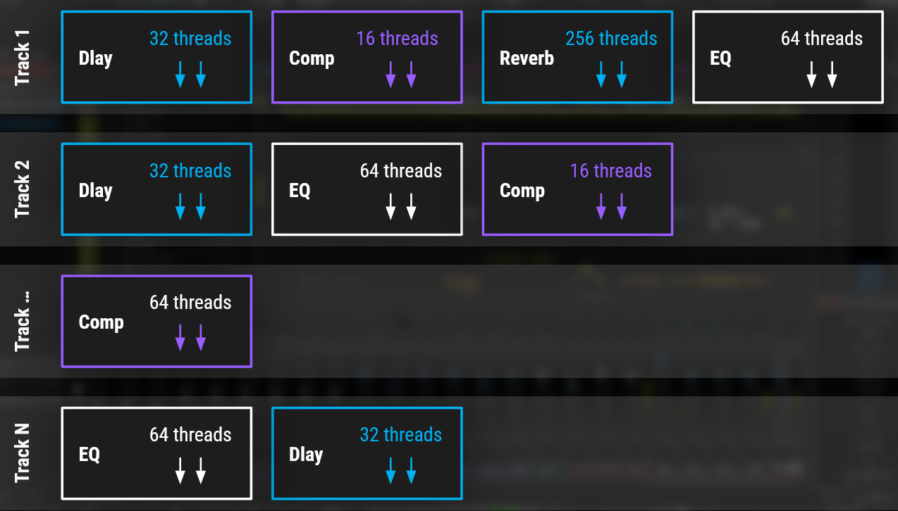
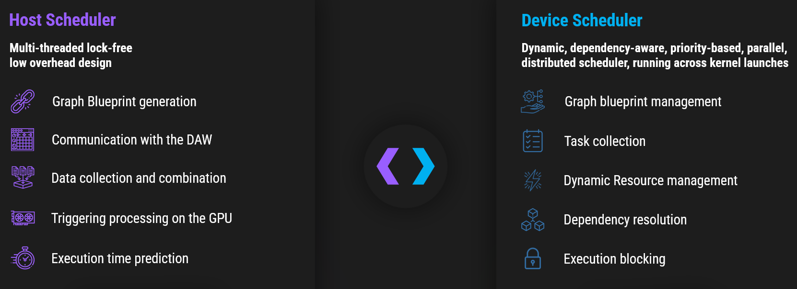
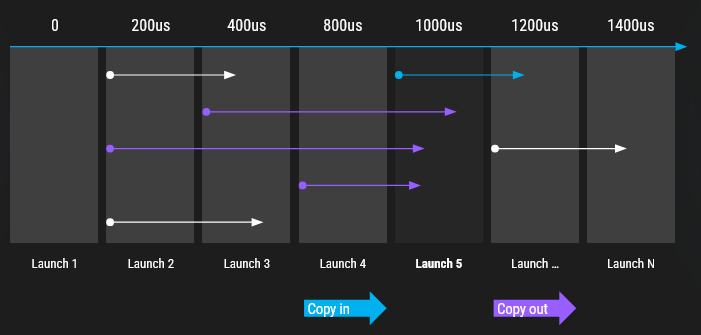
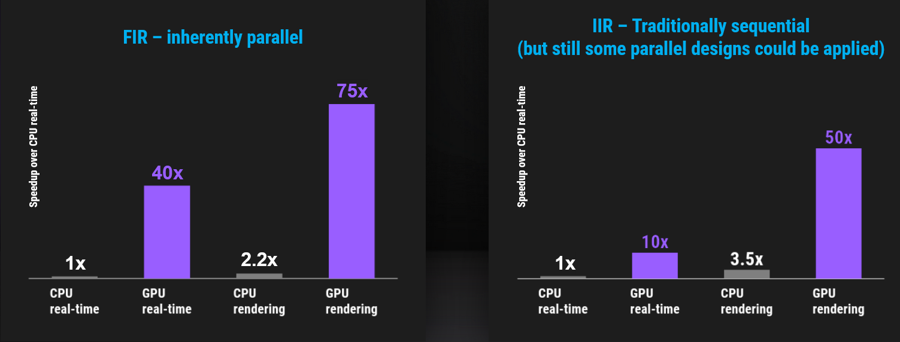

# GPU Audio SDK

## Installation
To install the GPU Audio SDK, please follow the [installation guide](installation/main.md "Installation Instructions") for your platform.

## Motivation and Introduction
The concept of GPU-based audio has long been met with skepticism. GPUs offer virtually unlimited power and scalability for digital audio, but the challenges have often outweighed the possibilities.

Despite ambitious efforts, previous attempts struggled to move beyond small-scale, bespoke implementations. 
A major roadblock was the **high latency**, making real-time implementations impractical.
GPUs, historically optimized for graphics and gaming, were designed for rendering frames�not for the strict real-time constraints of audio processing.

Professional audio software and hardware consistently face issues such as:
- **Bottlenecking**
- **Audio dropouts**
- **The need for multiple machines and dedicated DSP chips**

These problems become even more pronounced in modern audio applications involving high channel counts, ambisonic systems, or beamforming with large loudspeaker arrays. 
The growing role of AI in audio processing has further underscored the demand for real-time GPU acceleration, as traditional CPUs struggle with the computational load.
Unfortunately, traditional approaches cannot achieve low-latency processing and often separate digital signal processing (DSP) steps from neural network steps.

The **GPU Audio SDK** aims to overcome these challenges by unlocking the processing power of GPUs for both DSP and neural audio applications.

---

## Challenges Solved by the GPU Audio SDK

### 1. Parallelism and Heterogeneity of Processing Steps
Modern GPUs require a high number of parallel threads to be efficiently utilized. However, audio processing is often **inherently sequential**, limiting the available parallelism.  
While some processing steps, such as **delay lines (32 threads per step)** or **FIR filtering (hundreds of threads for local FFTs)**, can be parallelized, the degree of parallelism they offer alone is far from the tens of thousands of threads needed to properly utilize a modern GPU.  

Furthermore, many processing steps rely on the results of previous computations, enforcing a strict sequential dependency that limits parallelism.  

Moreover, different processing steps require **varying thread counts and execution models**, complicating workload optimization within the SIMD constraints of modern GPUs.  

### 2. Multiple Tracks and Processors
Digital Audio Workstations (DAWs) and audio processing services operate on **multiple tracks individually**. Each track is typically assigned a **single CPU thread**, processing small sample buffers (e.g., 1ms worth of data at 96kHz = 96 samples per buffer).  
This means a modern DAW may generate **hundreds of independent CPU calls** that must be efficiently batched for GPU execution.

<!--- 

--->
<figure class="image">
  
  <figcaption>Multiple audio tracks can run in parallel; each track may require multiple sequential processing steps; each processing step may offer various degrees of local parallelism. For efficient overall processing it is necessary to draw parallelism from both, multiple tracks and withing heterogeneous processing steps.</figcaption>
</figure>

### 3. Data Transfer Between CPU and GPU
Real-time processing requires **frequent, small data transfers** between the CPU and GPU.  
Each track delivers small sample buffers (e.g., 96 samples per 1ms window), necessitating frequent, low-latency data exchange between CPU and GPU-an operation traditional GPU architectures struggle to handle efficiently.

---

## GPU Audio Engine and Scheduler
To address these challenges, we developed the **GPU Audio Engine**, often referred to as the "Scheduler."
This is the core of the SDK and enables **real-time** GPU-based audio processing by efficiently scheduling execution requests.

To effectively use our SDK, it is helpful to understand the core functionality of the scheduler, as outlined below.
More detailed information can be found in the `engine_api` and `processor_api`.

### Dual-Scheduler Architecture
The GPU Audio Engine employs a dual-scheduler architecture to efficiently manage and execute audio processing tasks: the **Host Scheduler** and the **Device Scheduler**.
This approach ensures seamless coordination between the CPU and GPU, optimizing performance while maintaining ultra-low latency.

<!--- 

--->
<figure class="image">
  
  <figcaption>The dual scheduler design consists of both a CPU and a GPU part.</figcaption>
</figure>

#### Host Scheduler
The Host Scheduler operates on the CPU and is responsible for orchestrating the overall execution flow. 
It begins with a preparation phase, where it constructs blueprints for the processing graph. 
These blueprints define the sequence of operations required for audio processing, ensuring that all dependencies and execution paths are well-defined before real-time execution.

Once the blueprints are created, minimal communication between the CPU and GPU is required during runtime, enabling efficient processing and data transfer. 
Ideally, blueprints are generated once and reused for thousands or millions of processing requests, reducing overhead and ensuring consistent performance. 
If the processing setup (i.e., the processing graph) changes, the Host Scheduler regenerates the blueprints to accommodate new requirements.

During runtime, the Host Scheduler handles communication with Digital Audio Workstations (DAWs) and other audio software. 
It collects and combines incoming audio data from multiple tracks, ensuring that each processing request is efficiently batched before being sent to the GPU. 
Once processing is complete, it retrieves the processed audio data from the GPU and forwards it back to the audio source. 
Additionally, the Host Scheduler predicts execution time, optimizing scheduling by anticipating computational workloads and allocating resources accordingly.

#### Device Scheduler
The Device Scheduler operates on the GPU and is responsible for managing the actual execution of audio processing tasks.
Before runtime, it prepares the necessary computational resources by managing graph blueprints, which define how audio effects/processing tasks depend on each other, how much temporary memory is needed, where temporary data can placed and which computations depend on which other computations.

During execution, the Device Scheduler dynamically collects incoming tasks and efficiently distributes them across the GPU's processing units. 
It also manages resource allocation, ensuring that memory and compute resources are used optimally for each processing request.
The scheduler resolves dependencies between tasks, ensuring that operations are executed in the correct order while minimizing delays.

By tightly integrating these two schedulers, the GPU Audio Engine achieves efficient, high-performance audio processing, making real-time GPU-based DSP and neural audio processing viable for professional applications.

### Discretized Execution Windows
A key challenge in real-time audio processing is handling asynchronous track processing requests within tight time constraints (1ms per window). 
To meet this requirement, we discretize time into **100-200 microsecond windows**, resulting in **5-10 launches per millisecond**.

Each incoming request is assigned to the next available execution window. 
The scheduler is designed with a lock-free approach, combining incoming requests efficiently. 
Since resources for transfer and execution are pre-allocated, the scheduler can manage multiple requests simultaneously without blocking or waiting for resources to become available.

However, the number of requests that can be combined in each window is limited. 
The scheduler operates on a first-come, first-served basis, meaning that if a window is full, requests may be delayed until the next available call.

The scheduler estimates the required processing time based on the complexity of the effect graph, predicting when the result of the processing will be ready and which time window will contain the result. 
Internally, the scheduler tracks progress and, if processing is not finished on time, it extends the execution window until the result is ready.

### Efficient Memory and Data Transfers
To ensure efficient data transfer between the CPU and GPU, it is essential to combine multiple processing requests into a single memory transfer and processing operation. 
Building on the discretized execution windows, the scheduler combines all memory transfers for a given time window into a single transfer.

All incoming requests can simultaneously write their data to the transfer buffers, ensuring time-efficient processing. 
Similarly, the transfer of results from the GPU back to the CPU is combined in the same way, with the scheduler tracking which results are expected in which time window.
Data transfers are overlapped with previous and subsequent launches, ensuring continuous processing.

It is important to note that some devices, such as Apple Silicon, have a unified memory architecture, which eliminates the need for explicit data transfers between the CPU and GPU. 
However, shared buffers still need to be managed carefully to allow memory access from both the CPU and GPU. 
To this end, the scheduler also manages these buffers.

<!--- 
. As with the copy from GPU to CPU the copies from CPU to GPU are also combined into larger memory transfers and they are all scheduled to overlap the compute workloads.")
--->
<figure class="image">
  
  <figcaption>Execution of incoming requests are batched together so that they start with the next available execution window. The GPU Audio Engine predicts when execution requests will be finished and groups their data transfer accordingly (purple). As with the copy from GPU to CPU the copies from CPU to GPU are also combined into larger memory transfers and they are all scheduled to overlap the compute workloads.</figcaption>
</figure>

---

## Terms and Entities
The GPU Audio SDK introduces several terms and entities that are essential for understanding the architecture and functionality of the SDK.

### Processors
Processors represent individual audio processing tasks, such as filters, effects or neural network models. 
Each processor is a self-contained unit responsible for performing a specific audio processing operation. 
Processors can be combined to create complex audio processing graphs, enabling a wide range of audio effects and applications.

Processors may originate from different libraries or developers. 
The GPU Audio SDK acts as the glue between these processors, enabling their combination and parallel processing across different sources.

Processors can receive parameters either associated with specific audio samples or provided independently. 
When parameters are sent alongside the audio samples, all connected processors can access this data. 
The parameters are always provided through the same thread that initiates the GPU processing, ensuring no race conditions occur.

If parameters are provided separately, they may come from the thread initiating GPU processing or another thread. 
The GPU Audio Engine simply forwards the `SetData` call to the processors. 
The interpretation of the parameters is entirely up to the processor itself; the GPU Audio Engine does not interpret them.

Therefore, it is important to establish a "protocol" between the processor and the caller to ensure that the parameters are correctly interpreted.

### Ports
Ports are the input and output interfaces of processors, enabling them to send and receive audio and binary data. 
Input ports receive audio data from other processors or external sources, while output ports send processed audio data to other processors or back to the CPU.

Audio ports are defined in such a way that processors can interpret incoming data in a standardized format, ensuring compatibility between different processors. 
Binary ports, on the other hand, can hold any type of data, so it is the caller's responsibility to ensure that the data is interpretable by the processors.

A processor may offer any number of input ports, with connections established through the GPU Audio Engine using the `engine_api`. 
Similarly, processors can offer any number of output ports, with connections made using the `engine_api`.

It is important to note that an input port can only receive data from one output port, but an output port can send data to multiple input ports.

The processor is responsible for providing the data to its output ports, while the GPU Audio Engine simply forwards the data to the receivers.
However, the processor is notified if an output port is actually used and may choose not to provide data to unused output ports.

### Processing Graphs
Processing graphs represent the connections between processors, defining the flow of audio data through the system. Graphs are constructed by connecting the output ports of one processor to the input ports of another. 
In this context, processors form the nodes of the graph, while ports represent the edges that connect them.

A valid processing graph is always a directed acyclic graph (DAG), ensuring that audio data flows in a single direction without creating feedback loops. 
The GPU Audio Engine manages temporary buffer allocation, buffer reuse, and determines which processing steps can be executed in parallel by handling dependencies within the graph.

The processing graph also prepares the system for real-time processing. 
By analyzing the graph, the GPU Audio Engine determines the required resources and memory for each processing step, prepares dependency graphs, and organizes all scheduling information.
This prepared information is referred to as the blueprint of the processing graph.

The GPU Audio Engine manages this blueprint directly on the GPU and sends only the minimal necessary information to the GPU when executing a graph. 
This approach significantly reduces memory transfer, achieving a reduction of up to two orders of magnitude.

---

## Introductory Example
The GPU Audio SDK offers numerous tuning points, and there are always multiple ways to optimize processing performance. 
However, our goal is to provide a straightforward way to get started with high-performance audio processing on the GPU, while still leaving room for in-depth optimization if desired.

### Gain Processor: 
The `gain_processor` is the simplest example of GPU-based audio processing. 
It takes a buffer of audio samples and multiplies them by a constant factor. 
While this is a basic operation that could be performed on the CPU, it serves as an excellent starting point for understanding the core concepts of the GPU Audio SDK.

This example demonstrates how to set up and compile a processor, offer input and output ports, and execute a processing task on the GPU. 
The `gain_processor` utilizes the `processor_api` to implement a processor.

The `gain_launcher` is the corresponding example, showing how to use the `engine_api` to load GPU Audio, set up a simple processing graph, and execute processing on the GPU.
The `GainLib` project shows how the `gpu_audio_client` library can be utilized to simplify the setup and usage of the processor from a user's perspective.

---

## APIs
The GPU Audio SDK provides two main APIs: the `engine_api` and the `processor_api`.

### Processor API
The `processor_api` is used to implement audio processing tasks that run on the GPU. 
It provides the necessary interfaces to define input and output ports, process audio data, and manage processor-specific parameters.

### Engine API
The `engine_api` is used to interact with the GPU Audio Engine, enabling the creation of processing graphs, scheduling of audio processing tasks, and efficient data transfer between the CPU and GPU. 
It provides the necessary interfaces to load GPU Audio and processors, create processing graphs, and connect processors to one another. 
Additionally, it offers interfaces for both synchronous and asynchronous processing of processing graphs.

---

## Building Blocks
The GPU Audio SDK includes various building blocks that can be combined to create complex audio processing effects and applications.

### OS Utilities
The GPU Audio SDK provides utilities for managing operating system resources, such as memory allocation, threading, and synchronization primitives.
These are abstracted in the OS utilities and are typically used automatically when working with our examples.

### Processor Utilities
The header-only `processor_utilities` is a collection of platform-agnostic tools, helpers, utilities, and abstractions designed to simplify the process of writing GPU Audio-enabled parallel audio processors for different operating systems and GPU vendors.

### GPU Primitives
The header-only `gpu_primitives` offers a collection of GPU-accelerated primitives for GPU audio processing. 
These primitives are designed to leverage the power of GPUs to perform complex audio processing tasks efficiently. 
The repository includes implementations for matrix operations, vector operations, ring buffers, convolution, FFT calculations, and state-space filters.

This repository should be considered a starting point and currently contains only a subset of the functionality developed by the GPU Audio team. 
Additional building blocks will be provided in the future.

### GPU Audio Client

The `gpu_audio_client` is a header-only library for creating client applications. 
It implements common functionality required in most client applications, such as locating, loading, and instantiating the GPU Audio engine and processors, setting up the engine, and processing data. 
It offers both a simple synchronous executor and a more complex asynchronous executor with double buffering.

---

##  Example Projects
We provide four initial examples to help you get started with the GPU Audio SDK.

### Gain
The `gain_processor` and `gain_launcher` examples demonstrate how to implement a simple gain processor and execute it on the GPU.

###  Infinite Impules Response (IIR)
The `iir_processor` and `iir_launcher` examples show how to implement an Infinite Impulse Response (IIR) filter and execute it on the GPU.
It uses the state-space formulation to convert the sequential IIR design into a matrix formulation, enabling parallel execution.
There are more advanced techniques to extract parallelism for running IIR filters, which we plan to offer in future releases.

###  Finite Impulse Response (FIR)
The `fir_processor` and `fir_launcher` examples demonstrate how to implement a Finite Impulse Response (FIR) filter and execute it on the GPU.
It implements a uniform partitioned overlap-save algorithm to parallelize the FIR filter on the GPU. 
FFTs are executed within a single block on the GPU, with previous input blocks stored in the Fourier domain. 
As the input data stream crosses a partition boundary, all impulse response and previous input blocks are convolved in the Fourier domain, and the result is stored in the time domain.

<!--- 

--->
<figure class="image">
  
  <figcaption>For both inherent parallel processing tasks, like FIR, as well as for typically sequential processing, like IIR, using the GPU can lead to significant speedups.</figcaption>
</figure>

### Neural Amp Modeler (NAM)
The `nam_processor` and `NAMLib` examples demonstrate how to implement the neural amp model for the GPU.
We provide implementations for the long-short-term memory (LSTM) and Wavenet models, offering two distinct neural network processing examples.
The LSTM model implements a recurrent neural network (RNN) that keeps state and weights locally in registers and shared memory. 
The Wavenet model implements a convolutional neural network (CNN) that uses dilated convolutions to increase the receptive field of the network. 
Both models leverage our matrix and neural processing building blocks.

### Real-Time Sound Source Separation (RT3S)
The `rt3s_processor` and `RT3SLib` demonstrate how to implement the Sound Source Separation for the GPU.
The implementation is based on the HS-TasNet paper by Venkatesh et al. [1] and a publicly available python implementation [2] by Phil Wang.
The processor takes a stereo audio track, the `mixture` of sources, as input an outputs one stereo track for each of the four sources, i.e., `bass`, `drums`, `vocals` and `other`. HS-TasNet is a hybrid approach, which uses time-domain and frequency-domain features to seperate the input into the four sources. Both time and frequency branch as well as the shared layers are built using our neural processing building blocks.

[1] https://www.l-acoustics.com/wp-content/uploads/2024/04/real_time_demixer_2024_04_19.pdf  
[2] https://gitlab.com/lucidrains/HS-TasNet
